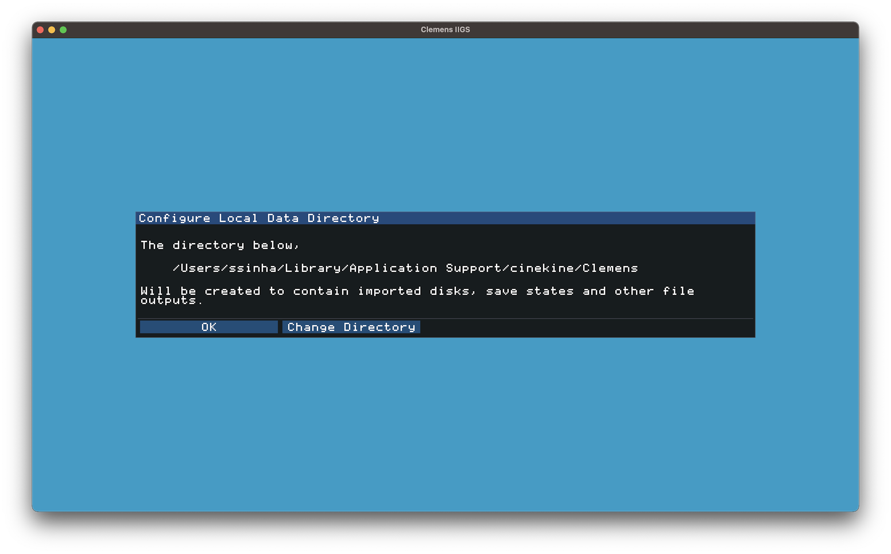
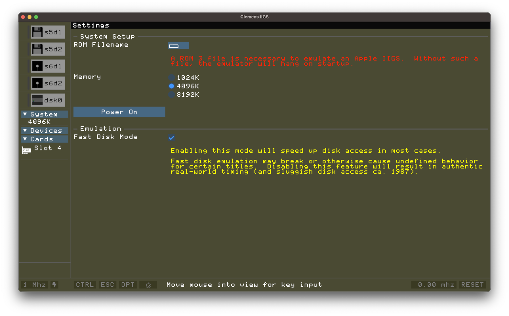
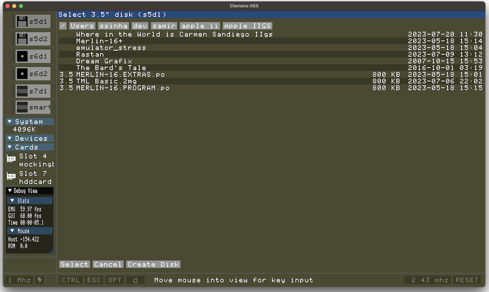
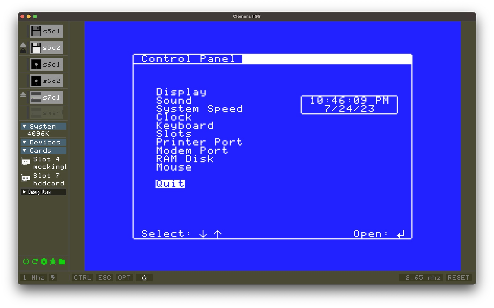

# Clemens IIGS Emulator

Clemens IIGS is an emulator for the Apple IIGS 16-bit system from the late 1980s.  
Its components include its own implementation of the various emulated hardware 
with a rich user frontend.

## Table of Contents

1. [Features](#section-support)
2. [Roadmap](#roadmap)
3. [Getting Started](#getting-started)
4. [Hotkeys](#hotkeys)
5. [Finding Software](#finding-roms)
5. [Debugger](#debugger)
6. [Troubleshooting](#troubleshooting)
7. [Missing Features](#known-issues)

## Features 

- Runs under Windows 10, macOS Catalina, or Linux 64-bit
- Standard Apple IIgs and IIx video modes
- Ensoniq and Mockingboard C audio (without SSI-263 voice)
- Joystick/Gamepad support
- Passes Self-Diagnostic Test
- Rich debugging features
- Load and save machine snapshots

**Hardware**

- 2.8 MHZ system speed
- 8 MB RAM
- ROM 3 Emulation
- 5.25", 3.5", Smartport and ProDOS peripheral hard drive emulation
- WOZ 2.0, DSK, DO, PO, 2IMG disk image formats

**User:**

- US keyboard layout
- Transfer of binary files to and from the system
- Paste text as keyboard input (at the BASIC/Monitor prompts)
- Debugging facilities (partial)

## Roadmap 

- Serial/terminal emulation
- ROM 1
- French and other international keyboard layouts
- Serial Printers
- Transwarp Speeds

## Getting Started 

Please see the [README](README.md) for the basics, installation and identifying
a ROM image for starting the emulator.  

This section will briefly cover what's required to get a system up and running
once installed.

1. Launch Clemens
2. Select the directory to place data created by the emulator
3. On the configuration screen, select the ROM file loaded upon machine startup
4. Change any configuration options if desired
5. Press 'Power On'
6. Running Apple II and IIgs software 

### Initial Launch and Setup

If this is the first time running Clemens on, you will be prompted to select 
the location for the Clemens `data` directory.  In most cases the user can just 
select the default and continue.

This data directory will contain items such as snapshots, traces and log files.
The selected location for this directory depends on the host's operating system
(i.e. Windows, macOS or Linux.)  

> **NOTE** 
>
> Typically this directory is hidden to users without explicitly making this 
> directory visible by means specific to the OS.  If you'd rather use another
> directory, when prompted navigate to the preferred directory location.
>
> See [Portable Installation] to control exactly where the data directory and 
> configuration files are located.

### Configuration ROM

The user is next presented with options to configure the emulated machine.

The first thing to do is select a ROM file loaded once the machine is powered
on.   **Currently only ROM 3 images are supported.  They are 256K in size.**

See the section on [finding ROMs and Apple II software](#finding-roms) if you
do not have such files available on your system.

Once you have a ROM file, you can select it by pressing the folder button at the
top of the setup screen. If no ROM is selected, the machine will power on to a 
screen filled with `@` characters. 

### Power On

If the remaining configuration options are OK, press 'Power On'.  The machine
should boot.  If you didn't select a ROM image you'll see the `@` screen.   

Unless you selected a disk image to boot, the emulator will stop at the 
standard Apple IIgs "Check Startup Disk" screen.  This is to be expected.

### Configuration Details

All configuration options are saved in a `config.ini` file located in a folder 
reserved for Clemens on the system (typically the same as the default data 
directory mentioned above.)

See [Portable Installation](#portable-installation) (as mentioned above) to 
ensure configurations are saved in the folder you want if the defaults aren't
sufficient.

> **NOTE**
> Fast Disk Emulation is recommended unless floppy disk load times ca. 1987 are
> acceptable.  Enabling this option as noted may result in audio glitches
> or other usability issues while the disk drive is powering down (as the 
> emulator switches from 'fast' to 'normal' speed.)

### Using Disks

On the left hand side of the main emulator screen is a tray of buttons representing
each of the supported disk drives on the system.   Once you have located software,
you can mount disks by pressing the appropriate drive button for the disk image you
with to use.

Typically IIgs applications use the "s5d1" and "s5d2" devices which represent the 3.5" disk
drives.   Legacy Apple II disks can be mounted using the "s6d1" and "s6d2" device buttons.

Currently Clemens does not support DOS 13 sector disks.  This restriction does not
apply to most Apple II titles from the 1980s.

## Operation (Hotkeys, etc.) 

This writeup isn't meant to be a complete tutorial on operating the Apple IIgs.
But you'll need to understand how to use the emulated Apple Desktop Bus Keyboard
(ADB) and how keys like `Open-Apple` and `Option` map to keys on your device.

Some of the below operations are available in the main menu.  But it's important
to understand how to use the keyboard to run certain operations.

| Platform |   Option   | Open Apple | Reset | Control Panel                 |
|----------|------------|------------|-------|-------------------------------|
| Windows  | Left Alt   | Right Alt  | F12   | Control + Right Alt + F1      |
| Linux    | Left Alt   | Right Alt  | F12   | Control + Right Alt + Tux + 1 |
| macOS    | Option     | Command    | F12   | Control + Command + F1        |

Common to all platforms is the `Escape Modifier` key.   That is, when pressing
either Alt/Option/Command keys, F1 acts as the Escape key.  This behavior is
due to how desktop environments typically treat Alt + Escape as a reserved
key combination.

### Windows

| Action                         | Key Combination                             |
|--------------------------------|---------------------------------------------|
| Break to BASIC                 | Control + F12                               |
| System Reset + Options Screen  | Control + Left Alt + F12                    |
| System Reset                   | Control + Right Alt + F12                   |
| Control Panel/Desk Accessories | Control + Right Alt + F1                    |

As a rule, the `Left Alt` and `Right Alt` keys map to `Option and Apple` keys
on the **ADB keyboard** respectively.

### Macintosh

| Action                         | Key Combination                             |
|--------------------------------|---------------------------------------------|
| Break to BASIC                 | Control + F12                               |
| System Reset + Options Screen  | Control + Option + F12                      |
| System Reset                   | Control + Command + F12                     |
| Control Panel/Desk Accessories | Control + Command + F1                      |

For Mac keyboards, `Option` and `Command` keys map to `Option and Apple` keys
on the **ADB keyboard** respecitvely.

### Linux

Depending on hardware, the Linux host's keyboard may also have a `Tux` key.  
This is synonymous with the Windows key on a modern PC keyboard.

| Action                         | Key Combination                             |
|--------------------------------|---------------------------------------------|
| Break to BASIC                 | Control + Tux + `=`                         |
| System Reset + Options Screen  | Control + Left Alt/Option + Tux + `=`       |
| System Reset                   | Control + Command + Tux + `=`               |
| Control Panel/Desk Accessories | Control + Command + Tux + `1`               |

Because of how Linux desktop environments handle the Alt + Fn key combination,
Clemens also supports a method to mock function keys by pressing *both* `Tux` and
a number key to generate a function key.  For example, a user can press `Control + Right Alt + Tux + 1`
which sends a `Control`, `Command` and `F1` key combination to the emulator. 

## Finding ROM and Software Files 

Clemens doesn't distribute any IIgs ROMs or software since they are still copyrighted
by Apple.   There are sites where one can find valid ROM files. 

There are two good sources for ROMs and software:

* [Asimov](https://mirrors.apple2.org.za/ftp.apple.asimov.net/)
* [What is the Apple IIgs](https://www.whatisthe2gs.apple2.org.za/)

The [Internet Archive](https://archive.org/details/wozaday?tab=collection) also 
contains WOZ disk images useful for copy protected software.

## Debugger 

## Troubleshooting 

## Missing Features 

* ROM 1 support
* Serial communication (over IP, then USB via emulation layer)
* Printer support
* International Keyboards
* Monochrome Graphics Modes
* Transwarp (8mhz+ native mode)
* Shadow bank bit 0 (Ninjaforce demo emulation)
* ROM 3 Mouse ADB Keypad emulation
* SHK, BXY disk image support

